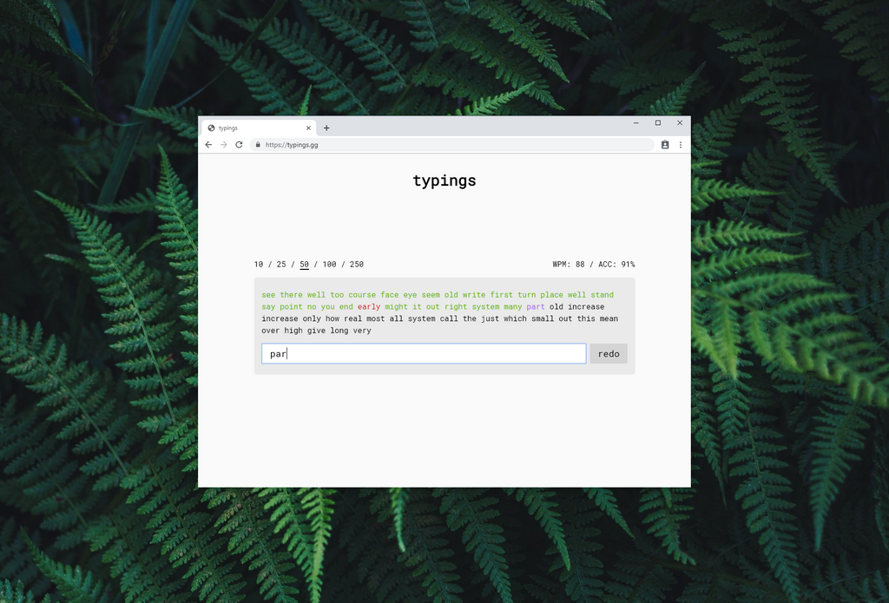

# typings

<a href="https://typings.gg" target="_blank">typings.gg</a> is a sleek and modern typing test website. it supports many custom themes

## theme

type the theme code for example `dracula` in the text box then hit [ windows: `alt` + `t` ], [ mac: `cmd` + `ctrl`+`t` ] or [ linux: `super` + `ctrl` + `t` ]

available themes:

- `aurora`
- `dark`
- `light`

- `burgundy` inspired by GMK Burgundy by cocobrais
- `carbon` inspired by SA Carbon by T0mb3ry
- `denim` inspired by GMK Denim by T0mb3ry
- `dracula` inspired by GMK Dracula by u/pikku-allu
- `eclipse` inspired by GMK Eclipse by T0mb3ry
- `handarbeit` inspired by [Cherry Handarbeit](https://pinchocodia.tistory.com/17)
- `hyperfuse` inspired by GMK HyperFuse origins by BunnyLake
- `mizu` inspired by GMK Mizu by u/Rensuya
- `moderndolch` inspired by GMK Modern Dolch by [Janglad](https://clavier.xyz)
- `mrsleeves` inspired by GMK Mr. Sleeves by [Taeha Types](https://www.taehatypes.com/)
- `nord` inspired by [Nord Theme](https://nordtheme.com)
- `nautilus` inspired by GMK Nautilus by [Zambumon](https://zambumon.com)
- `oblivion` inspired by SA Oblivion by u/Oblotzky
- `olivia` inspired by GMK Olivia by [Olivia](https://github.com/olivia)
- `phantom` inspired by GMK Phantom by u/briano1905
- `rama` inspired by [Rama Works](https://rama.works)
- `serika` inspired by GMK Serika by [Zambumon](https://zambumon.com)
- `solarizeddark` [bonus: `solarizedlight`] inspired by GMK Solarized Dark by u/thesiscamper
- `vilebloom` inspired by SA Vilebloom by u/UKKeycaps
- `yuri` inspired by GMK Yuri by T0mb3ry

## language

type the language code for example `german` in the text box then hit [ windows: `alt` + `l` ], [ mac: `cmd` + `ctrl`+`l` ] or [ linux: `super` + `ctrl` + `l` ]

available languages:

- `english`
- `english1000`
- `italian`
- `german`
- `spanish`
- `chinese`
- `korean`

## typing mode

type the mode code for example `time` in the text box then hit [ windows: `alt` + `m` ], [ mac: `cmd` + `ctrl`+`m` ] or [ linux: `super` + `ctrl` + `m` ]

available modes:

- `wordcount`
- `time`

## punctuation

type `true` or `false` then hit [ windows: `alt` + `p` ], [ mac: `cmd` + `ctrl`+`p` ] or [ linux: `super` + `ctrl` + `p` ] to activate/deactivate punctuations

## calculations

wpm: total number of characters (including spaces) of words you got right divided by five then divided by the time starting from first character typed

acc: total number of characters (including spaces) of words you got right divided by all character in the list of words

## support

- <a href="https://www.paypal.me/briano1905" target="_blank">PayPal</a>
